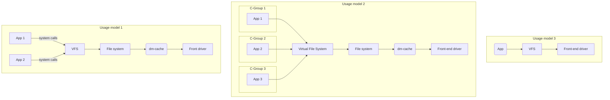

```mermaid 

graph TB
  
    subgraph Usage model 3
        App3(App) --> VFS3[VFS]
        VFS3[VFS] --> FD3[Front-end driver]
    end
    
    
    subgraph Usage model 2 
        subgraph C-Group 1
            U2App1[App 1] 
        end
         subgraph C-Group 2
            U2App2[App 2] 
        end
        subgraph C-Group 3
            U2App3[App 3] 
        end
    
        VFS2[Virtual File System] --> FS2[File system]
        FS2 --> DM2(dm-cache)
        DM2 --> FD2[Front-end driver]
        
        U2App1 --> VFS2
        U2App2 --> VFS2
        U2App3 --> VFS2
    
        
    end
    
    
    subgraph Usage model 1
        A[App 1] -- system calls --> VFS1[VFS]
        B[App 2] -- system calls --> VFS1
        VFS1 --> FS1[File system]
        FS1 --> DM1(dm-cache)
        DM1 --> FD1[Front driver]
        
        
        
    end

```

